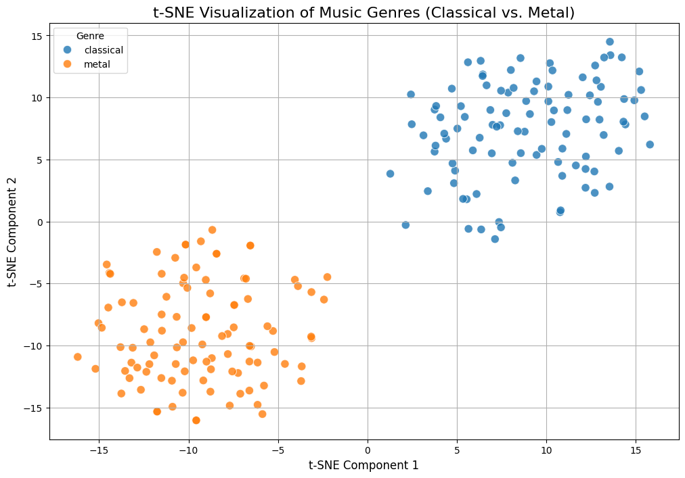

# Music Fingerprint Analyzer: A t-SNE Visualization Project

This project extracts core audio features from music tracks and uses the t-SNE algorithm to visualize the acoustic differences between two distinct genres: **Classical** and **Metal**.

The resulting visualization clearly demonstrates that the engineered features (MFCCs and Chroma) are powerful enough to create two distinct, separable clusters, proving their effectiveness in capturing unique genre "fingerprints."

## Result: t-SNE Visualization

The final plot shows a clear separation between the 100 classical tracks (blue) and the 100 metal tracks (orange).



---

## Project Pipeline

1.  **Data Loading:** Loads 30-second `.wav` files from the GTZAN dataset.
2.  **Feature Engineering:** For each track, the following features are extracted using `librosa`:
    * **MFCCs (13 coefficients):** Mean and Standard Deviation.
    * **Chroma (12 coefficients):** Mean and Standard Deviation.
    * This results in a 50-dimension feature vector for each song.
3.  **Data Preprocessing:** All 200 feature vectors are compiled into a `pandas` DataFrame and then standardized (mean=0, var=1) using `sklearn.preprocessing.StandardScaler`.
4.  **Dimensionality Reduction:** `sklearn.manifold.TSNE` is used to reduce the 50-dimensional feature space down to 2 dimensions for plotting.
5.  **Visualization:** `Seaborn` and `Matplotlib` are used to create the final scatter plot, coloring each point by its true genre.

---

## Technology Stack

* **Python 3.10+**
* **Librosa:** For audio feature extraction (MFCC, Chroma).
* **Scikit-learn (sklearn):** For `StandardScaler` and `TSNE`.
* **Pandas:** For data manipulation.
* **Numpy:** For numerical operations.
* **Seaborn & Matplotlib:** For data visualization.
* **Jupyter Lab:** For the analysis notebook.

---

## How to Run This Project

1.  **Clone the repository:**
    ```bash
    git clone [https://github.com/Aidin-Sahneh/Music-Fingerprint-Analyzer.git](https://github.com/Aidin-Sahneh/Music-Fingerprint-Analyzer.git)
    cd Music-Fingerprint-Analyzer
    ```

2.  **Download the Data:**
    * This project uses the **GTZAN Dataset (Music Genre Classification)**.
    * Download it from Kaggle: [GTZAN Dataset on Kaggle](https://www.kaggle.com/datasets/andradaolteanu/gtzan-dataset-music-genre-classification)
    * Unzip the file and place the `genres_original` folder inside a folder named `data/` in the root of this project. The final path for the audio files should look like: `data/genres_original/metal/metal.00000.wav`

3.  **Set up the Virtual Environment:**
    ```bash
    # Create the virtual environment
    python -m venv venv
    
    # Activate it (Windows)
    .\venv\Scripts\activate
    
    # Activate it (Mac/Linux)
    # source vVenv/bin/activate
    ```

4.  **Install Dependencies:**
    ```bash
    pip install -r requirements.txt
    ```

5.  **Run the Notebook:**
    ```bash
    jupyter lab analysis.ipynb
    ```